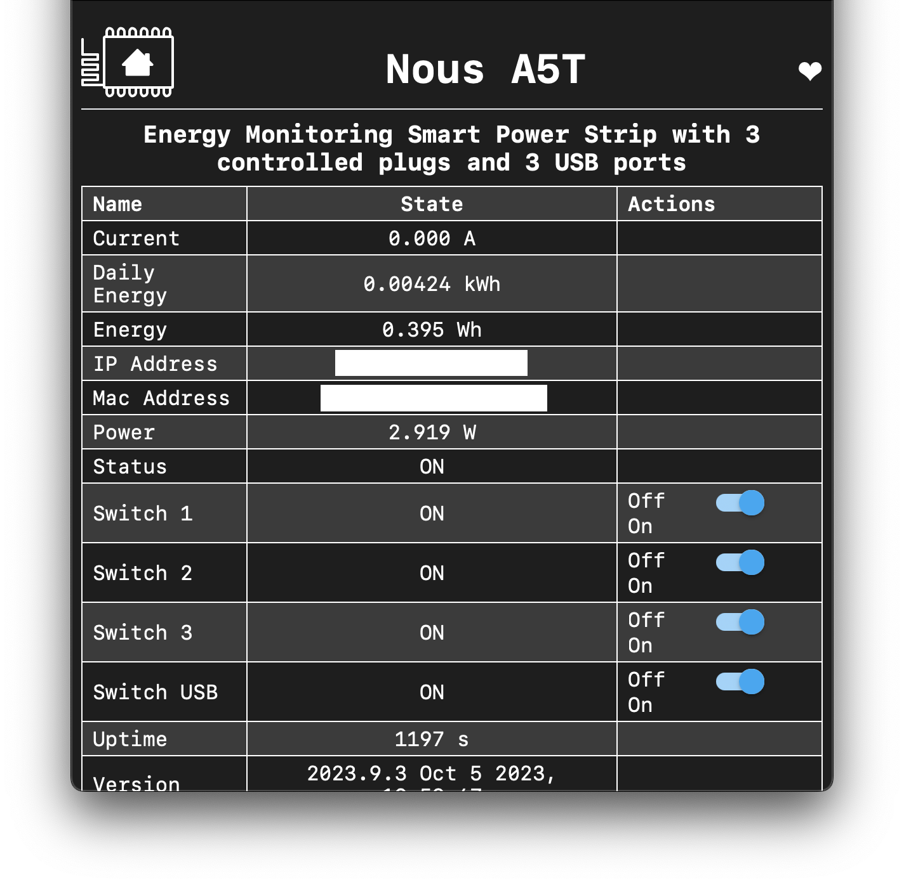

# Nous A5T ESPHome

ESPHome firmware for the Nous A5T WiFi power strip with energy monitoring.

ESPHome features:

- ESP8266 based
- [CSE7766 Power Sensor](https://esphome.io/components/sensor/cse7766.html)
- Captive portal for WiFi configuration (AP: Nous A5T - Access Point)
  - default password = `esphome`
- OTA updates
- Web server
- Home Assistant integration through [native API](https://esphome.io/components/api.html)

## Switching from Tasmota to ESPHome

By default this device comes with Tasmota firmware. To flash ESPHome, follow these steps:

1. Create a `secrets.yaml` file based on the `secrets.yaml.example` file and fill in your WiFi credentials.

```yaml
wifi_ssid: "your-wifi-ssid"
wifi_password: "your-wifi-password"
wifi_ap_password: "esphome"
```

2. Run `make compress` to compile the firmware and compress it using gzip.

   > Without compression, the firmware will not fit on the device and you will get a “Not enough space” error.

3. Open the Tasmota web interface and upload the compressed firmware (`firmware.bin.gz`) to the device.

   > If you still run into issues, try flashing the [Tasmota minimal firmware](http://ota.tasmota.com/tasmota/release/) first, restart and then flash the ESPHome firmware.

   > **!WARNING** Do not upgrade from a Tasmota minimal to minimal version. It will most likely fail at some point and will require flashing via serial.

The device will reboot and connect to your WiFi network, and should be auto-detected in Home Assistant.

## Screenshots


