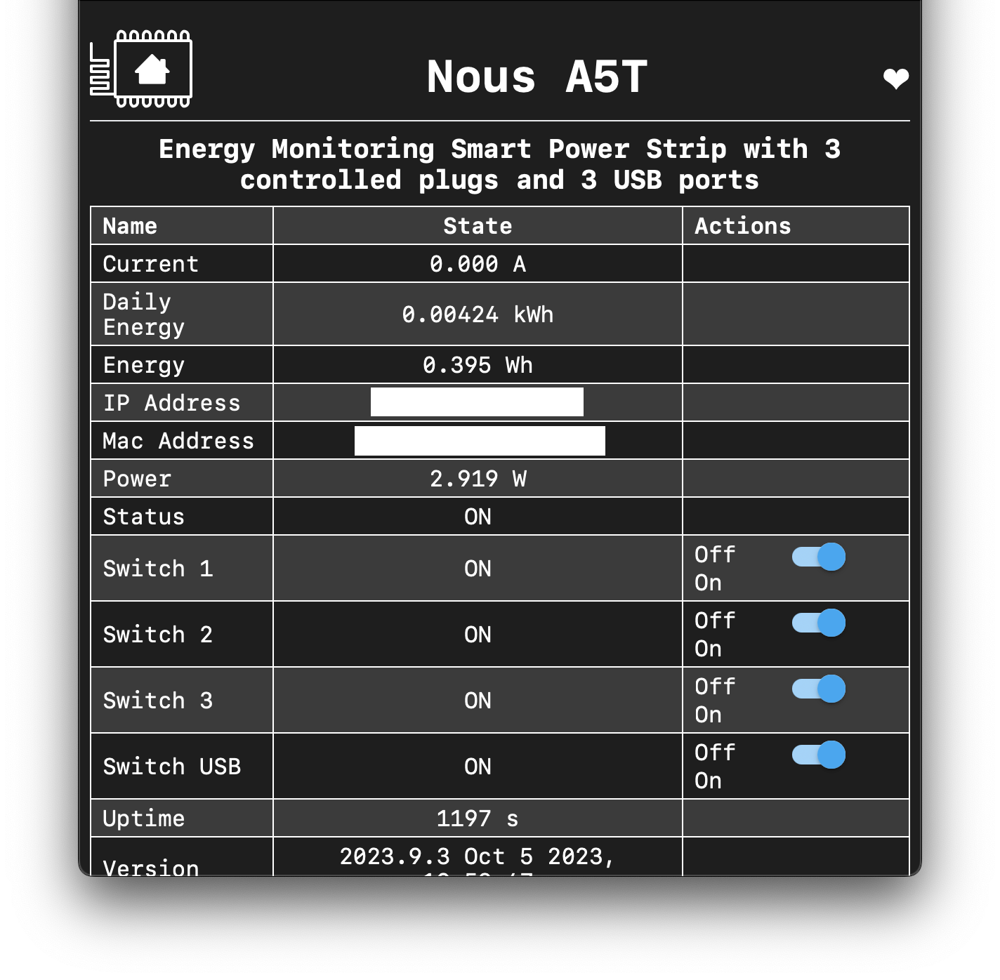

# Nous A5T ESPHome

ESPHome firmware for the Nous A5T WiFi power strip with energy monitoring.

ESPHome features:

- ESP8266 based
- [CSE7766 Power Sensor](https://esphome.io/components/sensor/cse7766.html)
- Captive portal for WiFi configuration (AP: Nous A5T - Access Point)
  - default password = `esphome`
- OTA updates
- Web server
- Home Assistant integration through [native API](https://esphome.io/components/api.html)

## Installation

### ESPHome Device Builder (recommended)

If you run the [ESPHome add-on](https://esphome.io/guides/getting_started_hassio.html) in Home Assistant:

1. For a new, unflashed device, select **Create configuration** → **Create new project** and complete the name and Wi-Fi setup. For a device already running this project's firmware, use **Adopt** instead.
2. Open the device's YAML editor. Keep the generated `esphome`, `api`, and `wifi` sections, but remove the generated `esp8266:` section. The board package below supplies the correct target (`esp8285`) and pin settings.
3. Add an `ota_password` secret to the `secrets.yaml` used by your ESPHome configuration. Use a unique, high-entropy password; it protects the device's OTA update endpoint.
4. Add the version ref and OTA settings to the top-level `substitutions` section:
```yaml
substitutions:
  # The left-hand names are fixed. Change only the secret name on the right.
  # Set this to main, a branch, a release tag, or a commit SHA.
  nous_a5t_ref: main
  ota_password: !secret ota_password
```
5. Add the device package under the top-level `packages` section. It provides the matching `esp8266:` target, sensors, switches, and required current ESPHome OTA configuration (`ota: - platform: esphome`). Do not add separate `esp8266:` or `ota:` sections:
```yaml
packages:
  yoziru.esphome-nous-a5t:
    url: https://github.com/yoziru/esphome-nous-a5t.git
    ref: ${nous_a5t_ref}
    files: [nous-a5t.dashboard.yml]
```
6. Save and **Install**. Future firmware updates are applied from this same device card with **Update**.

**Wrong board?** If the upload reaches 100% but ends with `Finishing update failed`, the firmware doesn't match your chip — this firmware only supports the Nous A5T (ESP8266/ESP8285).

Set `nous_a5t_ref` once to test a branch, tag, or commit SHA. Local CLI builds need no override because they use the current checkout's `packages/` directory.

For example, an adopted device with the YAML generated by current ESPHome Device Builder should look like this. Preserve the generated name, friendly name, API key, and Wi-Fi secrets from your device.
```yaml
substitutions:
  name: nous-a5t-123456
  friendly_name: Nous A5T 123456
  nous_a5t_ref: main
  ota_password: !secret ota_password

packages:
  yoziru.esphome-nous-a5t:
    url: https://github.com/yoziru/esphome-nous-a5t.git
    ref: ${nous_a5t_ref}
    files: [nous-a5t.dashboard.yml]

esphome:
  name: ${name}
  name_add_mac_suffix: false
  friendly_name: ${friendly_name}

api:
  encryption:
    key: !secret api_encryption_key

wifi:
  ssid: !secret wifi_ssid
  password: !secret wifi_password
  ap:
    password: !secret wifi_hotspot_password
```

Secret names are local to each user's dashboard. If yours differ, keep `ota_password` on the left and change only the name after `!secret`.

## Switching from Tasmota to ESPHome

By default this device comes with Tasmota firmware. To flash ESPHome, follow these steps:

1. Create a `secrets.yaml` file based on the `secrets.yaml.example` file and fill in your WiFi credentials.

```yaml
wifi_ssid: "your-wifi-ssid"
wifi_password: "your-wifi-password"
wifi_ap_password: "esphome"
```

2. Run `make compress` to compile the firmware and compress it using gzip.

   > Without compression, the firmware will not fit on the device and you will get a “Not enough space” error.

3. Open the Tasmota web interface and upload the compressed firmware (`firmware.bin.gz`) to the device.

   > If you still run into issues, try flashing the [Tasmota minimal firmware](http://ota.tasmota.com/tasmota/release/) first, restart and then flash the ESPHome firmware.

   > **!WARNING** Do not upgrade from a Tasmota minimal to minimal version. It will most likely fail at some point and will require flashing via serial.

The device will reboot and connect to your WiFi network, and should be auto-detected in Home Assistant.

## Screenshots


